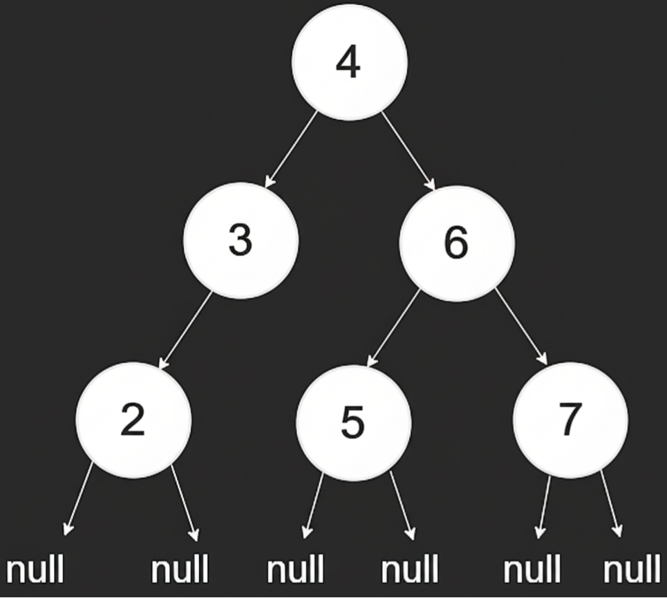
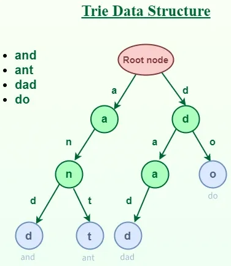

# ArrHash Notes:

---

1. **Euclid's Algorithm for GCD** [LC 1071](https://github.com/KaranBulani/leetcode_practise/blob/python/ArrHash%201071%20Greatest%20Common%20Divisor%20of%20Strings/Solution.py#L7)
   * The **GCD** of two integers is the largest number that divides both of them without leaving a remainder.
   * Suppose you want the GCD of two numbers `a` and `b` (with `a > b`):
     1. Divide `a` by `b`, and get the remainder `r`.
        That is: 
        `a = b * q + r  where  0 <= r < b`
        
     2. Replace `a` with `b`, and `b` with `r`.
     3. Repeat until `r = 0`.
     4. When `r = 0`, the GCD is the last nonzero divisor (the current `b`). 
   * Find GCD(48, 18):
      * Step 1: $48 ÷ 18 = 2$ remainder **12**
      * Step 2: Now find GCD(18, 12)
      * Step 3: $18 ÷ 12 = 1$ remainder **6**
      * Step 4: Now find GCD(12, 6)
      * Step 5: $12 ÷ 6 = 2$ remainder **0**
        
      ✅ Last nonzero divisor is 6 → **GCD(48, 18) = 6**
2. **Lowest Common Multiple**:
   * `LCM(a,b) * GCD(a,b) = a * b`
   * Example:`a = 12, b = 18`
   * `GCD(12, 18) = 6, LCM(12, 18) = 36`
   * `GCD(12, 18) * LCM(12, 18) = a*b`
   * `6 * 36 = 12 * 18`
   * `216 = 216`
3. **Kadane's Algorithm**: find the maximum sum of a contiguous subarray in an array of integers (which can contain both positive and negative numbers).
   * [LC 53](https://github.com/KaranBulani/leetcode_practise/blob/python/DivideAndConquer%2053%20Maximum%20Subarray/Solution.py) Normal Kadane's.
   * [LC 918](https://github.com/KaranBulani/leetcode_practise/blob/python/ArrHash%20918%20Maximum%20Sum%20Circular%20Subarray/Solution.py) Circular Kadane's Algorithm.

4. **Sieve of Eratosthenes**: — The algorithm works by **eliminating multiples** of each prime number starting from 2. [LC 204](https://github.com/KaranBulani/leetcode_practise/blob/python/ArrHash%20204%20Count%20Primes/Solution.py):
   * Create a list of boolean values `is_prime[0..n]` initialized to `True`.
   * Set `is_prime[0]` and `is_prime[1]` to `False`, because 0 and 1 are not prime.
   * For each number `i` from 2 to √n:
      * If `is_prime[i]` is `True`, mark **all multiples of `i`** (i.e., `i*i`, `i*i+i`, `i*i+2i`, ...) as `False`.
   * After the loop, all indexes `i` such that `is_prime[i]` is `True` are prime numbers.

5. **PrefixSums**: Draw the solution to understand if prefix sums would work or not
   * Like [304. Range Sum Query 2D - Immutable](https://github.com/KaranBulani/leetcode_practise/blob/python/ArrHash%20304%20Range%20Sum%20Query%202D%20-%20Immutable/Solution.py)
   * We can keep {0:1} as base case [LC 560](https://github.com/KaranBulani/leetcode_practise/blob/python/ArrHash%20560%20Subarray%20Sum%20Equals%20K/Solution.py), [LC 437](https://github.com/KaranBulani/leetcode_practise/blob/python/Tree%20437%20Path%20Sum%20III/Solution.py).
   * Might need to do some algebra instead of drawing with some base case [LC 523](https://github.com/KaranBulani/leetcode_practise/blob/python/ArrHash%20523%20Continuous%20Subarray%20Sum/Solution.py), [LC 974](https://github.com/KaranBulani/leetcode_practise/blob/python/ArrHash%20974%20Subarray%20Sums%20Divisible%20by%20K/Solution.py) or Algebra post some input manipulation [LC 1248](https://github.com/KaranBulani/leetcode_practise/blob/python/ArrHash%201248%20Count%20Number%20of%20Nice%20Subarrays/Solution.py).
   * For positive numbers, the prefix sum is always increasing, allowing binary search. [LC 2389](https://github.com/KaranBulani/leetcode_practise/blob/python/ArrHash%202389%20Longest%20Subsequence%20With%20Limited%20Sum/Solution.py)
   * Base case as {0:-1} and some input manipulation [LC 525](https://github.com/KaranBulani/leetcode_practise/blob/python/ArrHash%20525%20Contiguous%20Array/Solution.py)
   * Scanning window (`Not Expanding/Shrinking like Sliding Window`) on PrefixSum. Headache Sum [LC 1031](https://github.com/KaranBulani/leetcode_practise/blob/python/ArrHash%201031%20Maximum%20Sum%20of%20Two%20Non-Overlapping%20Subarrays/Solution.py) Can say rule of sliding window works here:
     * If a window `[a, b)` is valid, then shrinking it while maintaining non-overlap or size limits keeps it valid (until a constraint breaks).
     * Once a window violates a constraint (e.g., overlap or size), extending doesn’t make previous configurations valid again.
6. **Matrix Rotations**: _ALWAYS DRAW IT_.
   * 90 = transpose + reverse row.
   * 180 = reverse row + reverse column.
   * 270 = transpose + reverse col.
   * For sums with constant space constraints / For sums where we need to use matrix itself for storage, Try introducing more states like [LC 289](https://leetcode.com/problems/game-of-life/description/) or introduce some temp variables [LC 73](https://leetcode.com/problems/set-matrix-zeroes/description/).
---

# Binary Search Notes:

---
1. Binary Search can be used to search value in a sorted array. 
2. Or to test a range of solutions where all values less than equal a number works but greater than number doesn't work or vice-versa. 

3. Follow Either Pattern and don't mix it.
   
    #### CASE 1
   ```python
    # Exact target search
    # Last occurrence
    # First occurrence
    # Last valid / first invalid problems
    
    L, R = 0, n - 1 # Both are valid indices
    
    # Use <= because R is a real index, will run even for a single value
    while L <= R:
        mid = (L + R) // 2
        
        if condition:
            L = mid + 1   # mid already checked, so discard it
        else:
            R = mid - 1 # Note: Mid - 1, discard mid as mid already checked.
   
    # ---------------------------------------------------------
    # Loop Ends
    # ---------------------------------------------------------
    # R | L   (Pointers Cross)
    # R = last thing on left side (eg: Find last element <= target)
    # L = first thing on right side ((eg: Find first element > target)
    
    return L or R or mid # depending on 
    # | Need          | Return |
    # | ------------- | ------ |
    # | last valid    | `R`    |
    # | first invalid | `L`    |
    # | exact match   | `mid`  | Generally returned inside loop
    ```
    #### CASE 2
   ```python
    # Lower bound
    # Upper bound
    # First true
    # Insertion position
    # Monotonic predicate problems
   
    # Search Space: [L, R)  -> R is OUTSIDE array, not a valid indice
    L, R = 0, n
    # Use < because R is outside
    while L < R:
        mid = (L + R) // 2
        
        if condition:
            L = mid + 1
        else:
            R = mid 
        # Here, R is exclusive, so if we do R = mid - 1, that value will go out of scope due to while L < R:       
        # if Mid was valid, it would've ended earlier
   
    # ---------------------------------------------------------
    # Loop Ends
    # ---------------------------------------------------------
    # L == R   (Boundary Found) 
    # Single boundary point:
    # first true
    # lower bound
    # insertion position
    
    return L or R # doesnt matter as both are equal
    ```
    Problems with Mixing
    ```python
    # right is not a valid index
    # <= assumes it is
    left, right = 0, len(arr)
    while left <= right:
    
    # You’ll skip checking the last element
    left, right = 0, len(arr) - 1
    while left < right:
    ```
### 🔑 Notes for **162. Find Peak Element**

1. **Binary search intuition**

   * On an **uphill** (`nums[mid] < nums[mid+1]`) → a peak must exist on the **right side** (or the boundary).
   * On a **downhill** (`nums[mid] > nums[mid+1]`) → a peak must exist at `mid` or on the **left side**.
   * Each step halves the search space → **O(log n)** time, **O(1)** space.

2. **Loop condition**

   * Use `while low < high` (not `low <= high`)
   * Because we always compare `nums[mid]` and `nums[mid+1]` → both indices must be **in-bounds**.

3. **Comparison strategy**

   * Now as loop won't run when both low high are equal. 
   * We should increment decrement low high such that no value gets skipped.
   * So it would be `low = mid + 1` and `high = mid`, rather than `low = mid + 1` and `high = mid - 1`.
---
# 2 pointer/Sliding window:

---
Key Criteria for Two Pointers/Sliding Window:
1. Rule 1 (Validity of Wider Scope):  
   If a larger window (wider scope) is valid, all smaller sub-windows within it must also be valid.  
   - Example (Longest Substring Without Repeats):  
     If the substring `s[i...j]` is valid (no duplicates), then `s[i...k]` (where `k < j`) is also valid. This allows efficient shrinking of the window from the left (`i++`) when duplicates are found.
2. Rule 2 (Invalidity of Narrower Scope):  
   If a smaller window (narrower scope) is invalid, all larger windows containing it must also be invalid.  
   - Example:  
     If `s[i...j]` has duplicates, then `s[i...j+1]` (expanded window) will still have duplicates. This ensures we can discard invalid windows early.

Sums:
1. For [992](https://github.com/KaranBulani/leetcode_practise/blob/python/SlidingWindow%20992%20Subarrays%20with%20K%20Different%20Integers/Solution.py). `Subarrays with K Different Integers`
   * It doesn't follow any typical rules:
   * Rule 1 fails. For`nums = [1,2,1,2,3], k = 3` This`1,2,1,2,3` is valid but `1,2,1,2` is invalid.
   * Rule 2 fails. For`nums = [1,2,1,2,3], k = 3` This`1,2,1,2` is invalid but `1,2,1,2,3` is valid.
   * Reframe sum as: `exactly K distinct = at most K distinct − at most(K-1) distinct` and both follow 2 rules.
   * [LC 1248](https://github.com/KaranBulani/leetcode_practise/blob/python/ArrHash%201248%20Count%20Number%20of%20Nice%20Subarrays/Solution.py). `Count Number of Nice Subarrays` can also be same sum.
---
# Linked List Notes:

---
1. **\_\_repr\_\_**
   * The \_\_repr\_\_ method defines how an object is represented when you print it or look at it in the Python REPL (interactive shell, debugger, etc.).
      ```python
      # Definition for singly-linked list
      class ListNode:
          def __init__(self, val=0, next=None):
              self.val = val
              self.next = next
          def __repr__(self):
              return f"{self.val}->{self.next}" if self.next else f"{self.val}"
      ```
   * Without `__repr__`
   * If you didn’t define `__repr__`, printing a `ListNode` object would show something like below which isn’t human-readable.
      ```python
      <__main__.ListNode object at 0x7f123abc4560>
      ```
   * With your `__repr__`
   * If the node has a `.next`, it prints:
     ```
     val->next
     ```
     where `next` is also a `ListNode`, so it recursively calls `__repr__` again.

   * If it’s the last node (`next=None`), it just prints:

     ```
     val
     ```

2. `head` is nothing but 1st node and acts as a reference variable:
    ```python
       a = 10 # "a" stores reference to integer object.
       head = ListNode(1) # "head" stores reference to a ListNode object. 
       print(type(head)) # <class '__main__.ListNode'>
       print(head) #<__main__.ListNode object at 0x...>

    ```
3. **dummy node purpose**
   * Read [comment](https://github.com/KaranBulani/leetcode_practise/blob/python/LinkedList%2019%20Remove%20Nth%20Node%20From%20End%20of%20List/Solution.py#L18) to understand purpose of dummy node & also [here](https://github.com/KaranBulani/leetcode_practise/blob/python/LinkedList%202%20Add%20Two%20Numbers/Solution.py).


3. **Cut list when [needed](https://github.com/KaranBulani/leetcode_practise/blob/python/LinkedList%20143%20Reorder%20List/Solution.py#L55)** and also [here](https://github.com/KaranBulani/leetcode_practise/blob/python/LinkedList%202130%20Maximum%20Twin%20Sum%20of%20a%20Linked%20List/Solution.py#L23).

4. Slow and fast pointer like [here](https://github.com/KaranBulani/leetcode_practise/blob/python/LinkedList%20141%20Linked%20List%20Cycle/Solution.py), [here](https://github.com/KaranBulani/leetcode_practise/blob/python/LinkedList%20142%20Linked%20List%20Cycle%20II/Solution.py) and in [MergeSort](https://github.com/KaranBulani/leetcode_practise/blob/python/LinkedList%20148%20Sort%20List/Solution.py). 2pointer technique like [here](https://github.com/KaranBulani/leetcode_practise/blob/python/LinkedList%2082%20Remove%20Duplicates%20from%20Sorted%20List%20II/Solution.py)

5. **Doubly LinkedList usage of head and tail [LC 707](https://github.com/KaranBulani/leetcode_practise/blob/python/LinkedList%20707%20Design%20Linked%20List/Solution.py)** without head tail **[LC 1472](https://github.com/KaranBulani/leetcode_practise/blob/python/LinkedList%201472%20Design%20Browser%20History/Solution.py).** 

6. How [287. Find the Duplicate Number](https://github.com/KaranBulani/leetcode_practise/blob/python/LinkedList%20287%20Find%20the%20Duplicate%20Number/Solution.py) can be considered a LL problem. 

7. Usage of dictionary in [LC 138](https://github.com/KaranBulani/leetcode_practise/blob/python/LinkedList%20138%20Copy%20List%20with%20Random%20Pointer/Solution.py), Doubly LinkedList ( [LC 146](https://github.com/KaranBulani/leetcode_practise/blob/python/LinkedList%20146%20LRU%20Cache/Solution.py), [LC 432](https://github.com/KaranBulani/leetcode_practise/blob/python/LinkedList%20432.%20All%20O%60one%20Data%20Structure/Solution.py) ) & dict + prefix sum in [LC 1171](https://github.com/KaranBulani/leetcode_practise/blob/python/LinkedList%201171%20Remove%20Zero%20Sum%20Consecutive%20Nodes%20from%20Linked%20List/Solution.py).

8. Unique way to solve [LC 160](https://github.com/KaranBulani/leetcode_practise/blob/python/LinkedList%20160%20Intersection%20of%20Two%20Linked%20Lists/Solution.py).

---

# Heap:

---
1. Heap Nodes. [Heap.md](Heap.md)

Examples
1. Heap Implementation with Heapify. Kth Largest Element in a Stream [LC 703](https://github.com/KaranBulani/leetcode_practise/blob/python/Heap%20703%20Kth%20Largest%20Element%20in%20a%20Stream/Solution.py).
2. Last Stone weight. [LC 1046](https://github.com/KaranBulani/leetcode_practise/blob/python/Heap%201046%20Last%20Stone%20Weight/Solution.py).
3. Kth Largest Element in an Array [LC 215](https://github.com/KaranBulani/leetcode_practise/blob/python/Heap%20215%20Kth%20Largest%20Element%20in%20an%20Array/Solution.py).
4. K Closest Points to Origin [LC 973](https://github.com/KaranBulani/leetcode_practise/blob/python/Heap%20973%20K%20Closest%20Points%20to%20Origin/Solution.py).
5. Last Stone Weight [LC 1046](https://github.com/KaranBulani/leetcode_practise/blob/python/Heap%201046%20Last%20Stone%20Weight/Solution.py).
6. Task Scheduler [LC 621](https://github.com/KaranBulani/leetcode_practise/blob/python/Heap%20621%20Task%20Scheduler/Solution.py).
7. Design Twitter [LC 355](https://github.com/KaranBulani/leetcode_practise/blob/python/Heap%20355%20Design%20Twitter/Solution.py). Good trick to utilize heap.
8. Find Median From Data Stream [LC 295](https://github.com/KaranBulani/leetcode_practise/blob/python/Heap%20295%20Find%20Median%20from%20Data%20Stream/Solution.py). Maintaining two heaps.
9. Also Dual heap but insane. "Lazy Deletion" Sliding Window Median [LC 480](https://github.com/KaranBulani/leetcode_practise/blob/python/Heap%20480%20Sliding%20Window%20Median/Solution.py). 
10. Reorganize String [LC 767](https://github.com/KaranBulani/leetcode_practise/blob/python/Heap%20767%20Reorganize%20String/Solution.py). Good edge case handling.
10. Kth Smallest Element in a Sorted Matrix [LC 378](https://github.com/KaranBulani/leetcode_practise/blob/python/Heap%20378%20Kth%20Smallest%20Element%20in%20a%20Sorted%20Matrix/Solution.py). Heap with multiple element together at once.
11. IPO [LC 502](https://github.com/KaranBulani/leetcode_practise/blob/python/Heap%20502%20IPO/Solution.py). Build heap in stages.

---

# Tree Notes:

---
1. **Tree Node Structure**.
```python
class TreeNode:
    def __init__(self, val=0, left=None, right=None):
        self.val = val
        self.left = left
        self.right = right

    def __repr__(self):
        # Default: <__main__.TreeNode object at 0x0000020A0DB0AC50>

        # If you want to see the whole tree recursively (careful with big trees), you can do this:
        # TreeNode(val=10, left=TreeNode(val=5, left=None, right=None), right=TreeNode(val=15, left=None, right=None))
        return f"TreeNode(val={self.val}, left={repr(self.left)}, right={repr(self.right)})"

        # Show value and existence of children for debugging
        # TreeNode(val=10, left=5, right=15)
        return f"TreeNode(val={self.val}, left={self.left.val if self.left else None}, right={self.right.val if self.right else None})"
```

2. **Basic Tree Operations**
   * Insert in a BST [LC 701](https://github.com/KaranBulani/leetcode_practise/blob/python/Tree%20701%20Insert%20into%20a%20Binary%20Search%20Tree/Solution.py), Delete in a BST [LC 450](https://github.com/KaranBulani/leetcode_practise/blob/python/Tree%20450%20Delete%20Node%20in%20a%20BST/Solution.py).
   * Remember difference between `Binary Tree`[LC 236](https://github.com/KaranBulani/leetcode_practise/blob/python/Tree%20236%20Lowest%20Common%20Ancestor%20of%20a%20Binary%20Tree/Solution.py) vs `Binary Search Tree` [LC 235](https://github.com/KaranBulani/leetcode_practise/blob/python/Tree%20235%20Lowest%20Common%20Ancestor%20of%20a%20Binary%20Search%20Tree/Solution.py).
     * In BST value at right is more and at left is less.

3. **Depth First Search**

    

   * ###### **Inorder** - [2,3,4,5,6,7]
       ```python
       def inorder(root):
           if not root:
               return
           inorder(root.left)
           print(root.val)
           inorder(root.right)
       ```
     Swap left,right calls in inorder() to print in descending/reverse order.
   * Iterative implementation
       ```python
       def inorder_iterative(root):
           stack, res = [], []
           curr = root

           while stack or curr:
               # Reach the leftmost node
               while curr:
                   stack.append(curr)
                   curr = curr.left
               
               # Backtrack and visit node
               curr = stack.pop()
               res.append(curr.val)

               # Visit right subtree
               curr = curr.right

           return res
       ```
   * ###### **Preorder** - [4,3,2,6,5,7]
       ```python
       def preorder(root):
           if not root:
               return
           print(root.val)
           preorder(root.left)
           preorder(root.right)
       ```
   * Iterative implementation
       ```python
       def preorder_iterative(root):
           if not root:
               return []
       
           stack, res = [root], []
       
           while stack:
               node = stack.pop()
               res.append(node.val)  # Visit root first
       
               # Push right first so left is processed first
               if node.right:
                   stack.append(node.right)
               if node.left:
                   stack.append(node.left)
       
           return res
       ```
   * ###### **Postorder** - [2,3,5,7,6,4]
       ```python
       def postorder(root):
           if not root:
               return
           postorder(root.left)
           postorder(root.right)
           print(root.val)
       ```
   * Iterative implementation
       ```python
       def postorder_iterative_two_stacks(root):
           if not root:
               return []
       
           stack1, stack2, res = [root], [], []
       
           while stack1:
               node = stack1.pop()
               stack2.append(node)
       
               if node.left:
                   stack1.append(node.left)
               if node.right:
                   stack1.append(node.right)
       
           while stack2:
               res.append(stack2.pop().val)
       
           return res
       ```
   * Method B: One Stack (efficient)
       ```python
       def postorder_iterative(root):
           stack, res = [], []
           last_visited = None
           curr = root
       
           while stack or curr:
               if curr:
                   stack.append(curr)
                   curr = curr.left
               else:
                   peek = stack[-1]
                   if peek.right and last_visited != peek.right:
                       curr = peek.right
                   else:
                       res.append(peek.val)
                       last_visited = stack.pop()
       
           return res
       ```
4. **Breadth First Search**
   * Level Order - [4,3,6,2,5,7]
		```python
		from collections import deque

		def bfs(root):
			# Initialize a queue to keep track of nodes during level-order traversal
			queue = deque()
			
			res = [] # final result (list of levels)
			
			# If the root is not None, add it to the queue
			if root:
				queue.append(root)
			
			# Continue until the queue is empty
			while len(queue) > 0:
				level = [] # store values of nodes at the current level
				
				# Iterate over all nodes currently in the queue (current level)
				for _ in range(len(queue)):
					# Remove node from the front 
					curr = queue.popleft()
					# Add its value to the current level
					level.append(curr.val)
					
					# If the node has a left child, add it to the queue
					if curr.left:
						queue.append(curr.left)
					# If the node has a right child, add it to the queue
					if curr.right:
						queue.append(curr.right)
				
				# Append the current level's values to the result
				res.append(level)
			
			# Return the list of levels (level-order traversal result)
			return res
		```
**DFS SUMS**
1. How inorder and preorder list relate with each other. [LC 105](https://github.com/KaranBulani/leetcode_practise/blob/python/Tree%20105%20Construct%20Binary%20Tree%20from%20Preorder%20and%20Inorder%20Traversal/Solution.py)
2. Iterate over a tree (not all at once) [LC 173](https://github.com/KaranBulani/leetcode_practise/blob/python/Tree%20173%20Binary%20Search%20Tree%20Iterator/Solution.py)
3. With DFS two separate things can be calculated `Depth` vs `Res` & how both are different. Usage of `self` vs `nonlocal`. [LC 543](https://github.com/KaranBulani/leetcode_practise/blob/python/Tree%20543%20Diameter%20of%20Binary%20Tree/Solution.py)
   1. Again two separate things can be calculated `Good Node` vs `newMax`.[LC 1448](https://github.com/KaranBulani/leetcode_practise/blob/python/Tree%201448%20Count%20Good%20Nodes%20in%20Binary%20Tree/Solution.py)
   2. Again two separate things can be calculated `MaxPathSum` vs `MaxValue` to be sent on top. [LC 124](https://github.com/KaranBulani/leetcode_practise/blob/python/Tree%20124%20Binary%20Tree%20Maximum%20Path%20Sum/Solution.py)
4. How base case can be more than `return 0/None`. [LC 110](https://github.com/KaranBulani/leetcode_practise/blob/python/Tree%20110%20Balanced%20Binary%20Tree/Solution.py)
5. Not everytime you need to create DFS function. [LC 100](https://github.com/KaranBulani/leetcode_practise/blob/python/Tree%20100%20Same%20Tree/Solution.py), [LC 572](https://github.com/KaranBulani/leetcode_practise/blob/python/Tree%20572%20Subtree%20of%20Another%20Tree/Solution.py)
6. Space, time complexity of iterative and recursive Solution can be different. [LC 235](https://github.com/KaranBulani/leetcode_practise/blob/python/Tree%20235%20Lowest%20Common%20Ancestor%20of%20a%20Binary%20Search%20Tree/Solution.py)
7. How Inorder and PreOrder solution can be different. [LC 98](https://github.com/KaranBulani/leetcode_practise/blob/python/Tree%2098%20Validate%20Binary%20Search%20Tree/Solution.py) 
8. Serialize and deserialize using preorder. Normal Tree [LC 297](https://github.com/KaranBulani/leetcode_practise/blob/python/Tree%20297%20Serialize%20and%20Deserialize%20Binary%20Tree/Solution.py) vs BST [LC 449](https://github.com/KaranBulani/leetcode_practise/blob/python/Tree%20449%20Serialize%20and%20Deserialize%20BST/Solution.py)
9. How to handle list of list in tree recursion stack. [LC 113](https://github.com/KaranBulani/leetcode_practise/blob/python/Tree%20113%20Path%20Sum%20II/Solution.py) 
10. Backtracking on Tree [LC 437](https://github.com/KaranBulani/leetcode_practise/blob/python/Tree%20437%20Path%20Sum%20III/Solution.py) 
11. Count number of nodes in tree in O(logn) not O(n) [LC 222](https://github.com/KaranBulani/leetcode_practise/blob/python/Tree%20222%20Count%20Complete%20Tree%20Nodes/Solution.py)
12. Vertical Order Traversal [LC 987](https://github.com/KaranBulani/leetcode_practise/blob/python/Tree%20987%20Vertical%20Order%20Traversal%20of%20a%20Binary%20Tree/Solution.py)

**BFS SUMS**
1. How right side view can actually be a BFS solution. [LC 199](https://github.com/KaranBulani/leetcode_practise/blob/python/Tree%20199%20Binary%20Tree%20Right%20Side%20View/Solution.py)
2. BFS solution implemented with queue and two pointers. [LC 116](https://github.com/KaranBulani/leetcode_practise/blob/python/Tree%20116%20Populating%20Next%20Right%20Pointers%20in%20Each%20Node/Solution.py)

**BOTH**
1. Use of PreOrder DFS, queue in BFS for inverting a Binary Tree. [LC 226](https://github.com/KaranBulani/leetcode_practise/blob/python/Tree%20226%20Invert%20Binary%20Tree/Solution.py)
2. Height of tree using DFS, BFS  [LC 104](https://github.com/KaranBulani/leetcode_practise/blob/python/Tree%20104%20Maximum%20Depth%20of%20Binary%20Tree/Solution.py)
3. Morris Traversal which was tough. [LC 114](https://github.com/KaranBulani/leetcode_practise/blob/python/Tree%20114%20Flatten%20Binary%20Tree%20to%20Linked%20List/Solution.py).

---

# Trie Notes:

---
1. A **Trie** (pronounced *“try”*) is a **tree-based data structure** used to **store and search strings efficiently**, especially when working with **prefixes**. Each node represents a **character**, and paths from the root form words.

    

2. Suppose we insert these words: `apple, app, apply`
   * All words share the prefix **"app"**. The Trie stores this prefix **once**, then branches out
   * Each node has:
     * children (next characters)
     * a flag like `isEndOfWord`

    Example path:
    ```
    root → a → p → p → l → e
                       ↳ y
    ```
   Sample Trie Constructors:
    ```python
    # LC 211, 208
    class TrieNode:
        def __init__(self):
            self.children = {}
            self.isEndOfWord = False
    
    # LC 212
    class TrieNode:
        def __init__(self):
            self.children = {}
            self.word = None
    		
    # LC 1268
    class TrieNode:
        def __init__(self):
            self.children = {}
            self.suggestions = []
    		
    # LC 745
    class TrieNode:
        def __init__(self):
            self.children = {}
            self.index = -1
    # Skipping More
    ```
3. Purpose of a Trie

   A Trie is designed to **optimize string operations**, mainly:
   * Fast Word Search: Check if a word exists
     Time complexity: **O(L)** where L = length of the word 
   * Prefix Checking: Check if any word starts with a given prefix
     Perfect for **autocomplete**
   * Memory Efficiency for Shared Prefixes: Common prefixes are stored only once
     Very efficient for large dictionaries
   
   🚀 Common Use Cases
   * **Autocomplete / Search Suggestions**
   * **Spell Checkers**
   * **Dictionary Implementations**
   * **IP routing (longest prefix match)**
   * **Word games (Boggle, Scrabble solvers)**
4. ⚡ Why Not Use a HashSet?

    | Operation           | HashSet         | Trie           |
    | ------------------- |-----------------|----------------|
    | Search word         | O(1) avg        | O(L)           |
    | Prefix search       | ❌ Not possible | ✅ Efficient   |
    | Autocomplete        | ❌              | ✅             |
    | Lexicographic order | ❌              | ✅             |
    👉 Trie wins whenever prefixes matter

_Examples:_

_String with DFS search_
* Implement the Trie class. [LC 208](https://github.com/KaranBulani/leetcode_practise/blob/python/Trie%20208%20Implement%20Trie%20Prefix%20Tree/Solution.py) There is no branching so simple for-loop for searching is enough.
* Implement Trie but with custom Search [LC 211](https://github.com/KaranBulani/leetcode_practise/blob/python/Trie%20211%20Design%20Add%20and%20Search%20Words%20Data%20Structure/Solution.py). There is branching so for-loop searching wont work and Recursive-DFS backtracking solution would work. Another example [LC 676](https://github.com/KaranBulani/leetcode_practise/blob/python/Trie%20676%20Implement%20Magic%20Dictionary/Solution.py).

_Backtracking optimization with Trie_
* Given an `m x n` board of characters and a list of strings `words`, return _all words on the board._ Almost like [LC 79](https://github.com/KaranBulani/leetcode_practise/blob/python/Backtracking%2079%20Word%20Search/Solution.py) but enhancement/preprocessing using Trie [LC 212](https://github.com/KaranBulani/leetcode_practise/blob/python/Backtracking%20212%20Word%20Search%20II/Solution.py). Over here we move in `↑ ↓ → ←` but before exploring new state we verify with Trie.

_Design Problem_
* Design a system that suggests at most three product names from `products` after each character of `searchWord` is typed. [LC 1268](https://github.com/KaranBulani/leetcode_practise/blob/python/Trie%201268%20Search%20Suggestions%20System/Solution.py)

_Bit manipulation_
* Given an integer array `nums`, return the maximum result of `nums[i] XOR nums[j]`, where `0 <= i <= j < n`. [LC 421](https://github.com/KaranBulani/leetcode_practise/blob/python/Trie%20421%20Maximum%20XOR%20of%20Two%20Numbers%20in%20an%20Array/Solution.py) Create Trie bitwise for each number. Then how `greedy` leads to solution by fixing 1 number.
* Very Similar to above [LC 1707](https://github.com/KaranBulani/leetcode_practise/blob/python/Trie%201707%20Maximum%20XOR%20With%20an%20Element%20From%20Array/Solution.py) How we build Trie as new queries arrive, Not all nums at once. Sorting and keeping original index intact. Trie approach is similar to above.

_Clever String manipulation_
* Design a special dictionary that searches the words in it by a prefix and a suffix. [LC 745](https://github.com/KaranBulani/leetcode_practise/blob/python/Trie%20745%20Prefix%20and%20Suffix%20Search/Solution.py) Convert `prefix + suffix` search into **single prefix search** using `suffix + '#' + word`.
* Design an algorithm that accepts a stream of characters and checks if a suffix of these characters is a string of a given array of strings words. [LC 1032](https://github.com/KaranBulani/leetcode_practise/blob/python/Trie%201032%20Stream%20of%20Characters/Solution.py) Insert word in reverse order and maintain a queue for word stream.
* (TOUGH) Form Palindrome Pairs [LC 336](https://github.com/KaranBulani/leetcode_practise/blob/python/Trie%20336%20Palindrome%20Pairs/Solution.py). Insert word in Trie in reversed order storing `End of Word` & if remaining reversed word is palindrome or not by storing indices, then once again traverse words char by char in normal order. 

_DP + DFS + String manipulation_
* Given an array of strings words (without duplicates), return all the concatenated words in the given list of words. [LC 472](https://github.com/KaranBulani/leetcode_practise/blob/python/Trie%20472%20Concatenated%20Words/Solution.py) DP memoization of Trie using start indexes or DP Memozation of Array fixing End index and variable start index.
---

## Fenwick Tree (Binary Indexed Tree - BIT) Notes:

---


Refer: [GFG Article](https://www.geeksforgeeks.org/dsa/binary-indexed-tree-or-fenwick-tree-2/) or [YT](https://youtu.be/CWDQJGaN1gY?si=YV3ObHkfWAcKXONh)
1. Good for Prefix Sum with regular updates. [LC 307](https://github.com/KaranBulani/leetcode_practise/blob/python/FenwickTree%20307%20Range%20Sum%20Query%20Mutable/Solution.py) For Notes checkout comment
2. [LC 315](https://github.com/KaranBulani/leetcode_practise/blob/python/FenwickTree%20SegmentTree%20315%20Count%20of%20Smaller%20Numbers%20After%20Self/Solution.py) Count of Smaller Numbers after self.
3. Each node of tree stores sum of values, `get_parent` `x - (x & -x)` for calculating sum and `get_next` `x + (x & -x)` for building array.
```python
    Segment Tree → needs associative 
    Fenwick Tree → needs associative + invertible
    
    Assosiative: (a ∘ b) ∘ c = a ∘ (b ∘ c)
    (2 + 3) + 4 = 2 + (3 + 4) Both = 9, So addition is associative.
    min( min(5, 2), 6) = min(5, min(2, 6) ) Both = 2, So min is associative.
    (5 − 3) − 2 != 5 − (3 − 2) 2 ≠ 4, So subtraction is NOT associative. 
    
    Invertible: a ∘ b = c there exists an operation to get back a using c and b. 
    Addition (Invertible):     a + b = c We can recover: a = c − b So addition has inverse = subtraction.
    Minimum (NOT Invertible):  min(a, b) = 2 Can you recover a? No. 
    min(2, 10) = 2
    min(2, 3) = 2
    min(2, 1000) = 2 
    You cannot know what was removed. So, min has no inverse.
```
---
## Segment Tree:

---
1. Segment Tree explanation: [LC 307](https://github.com/KaranBulani/leetcode_practise/blob/python/SegmentTree%20307%20Range%20Sum%20Query%20Mutable/Solution.py)
2. [LC 315](https://github.com/KaranBulani/leetcode_practise/blob/python/FenwickTree%20SegmentTree%20315%20Count%20of%20Smaller%20Numbers%20After%20Self/Solution.py) Count of Smaller Numbers after self.
3. Lazy Segment Tree [LC 729](https://github.com/KaranBulani/leetcode_practise/blob/python/SegmentTree%20729%20My%20Calendar%20I/Solution.py)
```python
0 indexed
Left = 2i + 1
Right = 2i + 2
Parent = (i-1)//2

1 indexed
Left =  2i
Right = 2i + 1
Parent = i//2
```
---

## Union Find (Disjoint sets):

---
Union-Find is a data structure that helps you efficiently:
1. Check if two elements belong to the same group
2. Merge two groups
Think of it as managing **connected components**.

### Core Operations

1️⃣ **Find(x)**: Returns the **representative (parent)** of the set that `x` belongs to. If two elements have the same representative → they are in the same set.

2️⃣ **Union(x, y)**: Merges the sets containing `x` and `y` considering rank.

### Basic Idea (Intuition)

Imagine each element starts as its **own parent**:
```
0   1   2   3   4
```
After some unions:
```
0 → 1 → 2
3 → 4
```

Now:
* `{0,1,2}` is one group
* `{3,4}` is another

### Naive Implementation (Slow ❌)

```python
parent = [i for i in range(n)]

def find(x):
    while parent[x] != x:
        x = parent[x]
    return x

def union(x, y):
    px = find(x)
    py = find(y)
    parent[px] = py
```

⛔ Problem: Can become a **long chain → O(N)** per operation.

### Optimized Union-Find 

#### _Array implementation_

Two optimizations make it **almost O(1)**:

🔹 1. Path Compression (in Find) - Flatten the tree while finding parent.
```python
def find(x):
    if parent[x] != x:
        parent[x] = find(parent[x])
    return parent[x]
```
🔹 2. Union by Rank / Size Attach - the **smaller tree under the larger tree**.

```python
parent = [i for i in range(n)]
rank = [0] * n

def union(x, y):
    px = find(x)
    py = find(y)

    if px == py:
        return

    if rank[px] < rank[py]:
        parent[px] = py
    elif rank[px] > rank[py]:
        parent[py] = px
    else:
        parent[py] = px
        rank[px] += 1
```
_At the end:_ 
```python
For edges = [[1, 2], [2, 3], [3, 4], [1, 4], [1, 5]]
 * self.parent will be = {1: 1, 2: 1, 3: 1, 4: 1, 5: 1}
 * self.rank will be = {1: 1, 2: 0, 3: 0, 4: 0, 5: 0}
```

#### _HashMap Implementation - Initialization (Lazy) - Works with Strings_
_Note: How `find` & `union` function are same._
```python
parent = {}
rank = {}

def find(x):
    if x not in parent:
        parent[x] = x
        rank[x] = 0

    if parent[x] != x:
        parent[x] = find(parent[x])

    return parent[x]

def union(x, y):
    px = find(x)
    py = find(y)

    if px == py:
        return

    if rank[px] < rank[py]:
        parent[px] = py
    elif rank[px] > rank[py]:
        parent[py] = px
    else:
        parent[py] = px
        rank[px] += 1
```

### Time Complexity 

| Operation | Complexity |
| --------- | ---------- |
| Find      | `O(α(N))`  |
| Union     | `O(α(N))`  |

Where **α(N)** = Inverse Ackermann function
👉 Grows so slowly that for all practical inputs: **≈ constant time**

### When do we use it?
Whenever the problem involves:
* Connectivity
* Grouping elements dynamically
* Detecting cycles

**Classic use cases:**
* Graph connectivity
* Cycle detection in undirected graphs
* Kruskal’s MST
* Number of connected components
* Dynamic friend / network problems

_Examples:_
1. Count connected components, pure vanilla UnionFind [LC 323](https://github.com/KaranBulani/leetcode_practise/blob/python/UnionFind%20323%20Number%20of%20Connected%20Components%20in%20an%20Undirected%20Graph/Solution.py), [LC 200](https://github.com/KaranBulani/leetcode_practise/blob/python/UnionFind%20200%20Number%20of%20Islands/Solution.py).
2. Return an edge that can be removed so that the resulting graph is a tree of n nodes. [LC 684](https://github.com/KaranBulani/leetcode_practise/blob/python/UnionFind%20684%20Redundant%20Connection/Solution.py) If an edge while addition has same parents then that edge is the result.
3. Custom UnionFind via size, not via rank. [LC 128](https://github.com/KaranBulani/leetcode_practise/blob/python/ArrHash%20128%20Longest%20Consecutive%20Sequence/Solution.py)
4. Each email uniquely identifies a person. Accounts are merged if they share at least one email. Name is just metadata; emails drive the merge [LC 721](https://github.com/KaranBulani/leetcode_practise/blob/python/UnionFind%20721%20Accounts%20Merge/Solution.py) UnionFind + Heavy Implementation. 
5. Graph Valid Tree [LC 261](https://github.com/KaranBulani/leetcode_practise/blob/python/UnionFind%20261%20Graph%20Valid%20Tree/Solution.py). Neetcode.io problem.

---
# Graphs:

---
Matrix Examples - 
1. Flood Fill [LC 733](https://github.com/KaranBulani/leetcode_practise/blob/python/Graph%20733%20Flood%20Fill/Solution.py).
2. Max Area of Island [LC 695](https://github.com/KaranBulani/leetcode_practise/blob/python/Graph%20695%20Max%20Area%20of%20Island/Solution.py).
3. BFS - Shortest Path in Binary Matrix [LC 1091](https://github.com/KaranBulani/leetcode_practise/blob/python/Graph%201091%20Shortest%20Path%20in%20Binary%20Matrix/Solution.py).
4. BFS (From multiple Start) - Rotting Oranges [LC 994](https://github.com/KaranBulani/leetcode_practise/blob/python/Graph%20994%20Rotting%20Oranges/Solution.py)
5. BFS (From multiple Start) - Islands and Treasure [LC 268](https://github.com/KaranBulani/leetcode_practise/blob/python/Graph%20268%20Islands%20and%20Treasure/Solution.py). Neetcode.io problem.
6. BFS (From Multiple Start) - Pacific Atlantic Water flow [LC 417](https://github.com/KaranBulani/leetcode_practise/blob/python/Graph%20417%20Pacific%20Atlantic%20Water%20Flow/Solution.py).
7. DFS/BFS - Surrounded Region [LC 130](https://github.com/KaranBulani/leetcode_practise/blob/python/Graph%20130%20Surrounded%20Regions/Solution.py).

Edge Examples -
1. Tree Diameter [LC 1245](https://github.com/KaranBulani/leetcode_practise/blob/python/Graph%201245%20Tree%20Diameter/Solution.py).

Adjacent List Examples - 
1. We use old_to_new dictionary to Clone Graph [LC 133](https://github.com/KaranBulani/leetcode_practise/blob/python/Graph%20133%20Clone%20Graph/Solution.py).
2. Topological Sort (DFS Easy) - https://neetcode.io/courses/advanced-algorithms/17 or https://leetcode.com/discuss/post/1078072/introduction-to-topological-sort-by-sinc-i0ii/
   1. Topological Sort with cycle detection, Course Schedule [LC 207](https://github.com/KaranBulani/leetcode_practise/blob/python/Graph%20207%20Course%20Schedule/Solution.py).
   2. Course Schedule II [LC 210](https://github.com/KaranBulani/leetcode_practise/blob/python/Graph%20210%20Course%20Schedule%20II/Solution.py).

Generating Graphs -
1. Word Ladder [LC 127](https://github.com/KaranBulani/leetcode_practise/blob/python/Graph%20127%20Word%20Ladder/Solution.py).


---
# Backtracking:

---
1. Exploring all possible combinations or paths that can be formed from a given set or structure, and you accumulate a sum along the way. 
   1. The recursion (or backtracking) builds the sum incrementally, **exploring both inclusion and exclusion possibilities**. 
   2. Each “sum” corresponds to one complete path of decisions (include/exclude, go left/right, etc.). 
   3. You don’t revisit nodes or edges — it’s choice-based, not connection-based.
2. Types of Sums:

   1. Subset (`DFS - Recursive` & `BFS - Recursive`): Take or Not Take with input having duplicates or not.
   
       _A subset is any selection of elements (possibly none or all) from a set, without caring about order._
       
       * ✅ _Order doesn’t matter (so we dont include results which have same number but different order)_
       * ✅ _Can include empty set_
       * ❌ _No repetition_
   * For nums = [1,2,3]  `[], [1], [2], [3], [1,2], [1,3], [2,3], [1,2,3]`

     _Example:_
     1. Given an integer array nums of unique elements, return all possible subsets. [LC 78](https://github.com/KaranBulani/leetcode_practise/blob/python/Backtracking%2078%20Subsets/Solution.py)
     2. Given an integer array nums that may contain duplicates, return all possible subsets. [LC 90](https://github.com/KaranBulani/leetcode_practise/blob/python/Backtracking%2090%20Subsets%20II/Solution.py) 
        * **In the DFS-style implementation (first solution):** We skip **all consecutive duplicates of the current element** when exploring the *exclude* branch. This ensures that once we decide **not** to include a value, we also skip every identical value that follows at deeper recursion levels.
        * **In the BFS/for-loop-style backtracking (second solution):** We skip duplicates **only at the same recursion level** using the condition `i > start and nums[i] == nums[i - 1]`.  This prevents choosing the same number twice *within a single loop iteration level*, but still allows duplicates to be chosen in deeper levels when valid. Note: In DFS implementation **we skip all dups of current element** while excluding. In BFS **we skip dups at same level** while starting a new tree branch. Additional `i > start` filter while skipping dups in `for loop` solution implementation.
     3. Given a string s, you can transform every letter individually to be lowercase or uppercase to create another string. [LC 784](https://github.com/KaranBulani/leetcode_practise/blob/python/Backtracking%20784%20Letter%20Case%20Permutation/Solution.py). Above we either pick a number or skip a number, Here we either uppercase or lowercase a character.
   
   2. Combination (`DFS - Recursive` & `BFS - Iterative + Recursive`): Go through each nums (`For Loop`) and choose. 

       _A combination is choosing `r` elements without caring about order, but of fixed size. ➡️ Number of combinations = nCr = n! / (r!(n−r)!)_
       
       * ✅ _Order doesn’t matter_
       * ❌ _No repetition_
       * ⚖️ _Fixed size (r elements)_
   * For nums = [1,2,3]
       ```
       Combinations of size 2: [1,2], [1,3], [2,3]
       Combinations of size 3: [1,2,3]
       ```
       _Example:_
       1. Given two integers `n` and `k`, return all possible combinations of `k` numbers chosen from the range `[1, n]`. [LC 77](https://github.com/KaranBulani/leetcode_practise/blob/python/Backtracking%2077%20Combinations/Solution.py)
       2. Given an array of **distinct** integers `candidates` and a target integer `target`, return a list of all _**unique combinations**_ of `candidates` where the chosen numbers sum to `target`.[LC 39](https://github.com/KaranBulani/leetcode_practise/blob/python/Backtracking%2039%20Combination%20Sum/Solution.py)
       3. Given an array of `candidate` numbers (which may contain duplicates) and a `target` value, return all unique combinations where the numbers sum to the target. Each `candidate` may be used at most once, and the result must not contain duplicate combinations. [LC 40](https://github.com/KaranBulani/leetcode_practise/blob/python/Backtracking%2040%20Combination%20Sum%20II/Solution.py)
       4. Return all unique quadruplets in nums whose sum equals target. This is optimized [LC 18](https://github.com/KaranBulani/leetcode_practise/blob/python/Backtracking%2018%204Sum/Solution.py). **Note:** Solution like [LC 40](https://github.com/KaranBulani/leetcode_practise/blob/python/Backtracking%2040%20Combination%20Sum%20II/Solution.py) can work here if not failure happening due to TLE.
       5. Given a string containing digits from 2-9 inclusive, return all possible letter combinations that the number could represent. [LC 17](https://github.com/KaranBulani/leetcode_practise/blob/python/Backtracking%2017%20Letter%20Combinations%20of%20a%20Phone%20Number/Solution.py)

   3. Permutation(`DFS - Recursive` & `BFS - Iterative + Recursive` & `Iterative (recursively and not recursively)`).
    
       _A permutation is choosing `r` elements where order matters. ➡️ Number of permutations = nPr = n! / (n−r)!_
       
       * ✅ _Order matters_
       * ❌ _No repetition_
       * ⚖️ _Fixed size (r elements)_
   * For nums = [1,2,3]  
       ```
       [1,2,3], [1,3,2], [2,1,3], [2,3,1], [3,1,2], [3,2,1]
       ```
       _Example:_
       1. Given an array nums of distinct integers, return all the possible permutations. [LC 46](https://github.com/KaranBulani/leetcode_practise/blob/python/Backtracking%2046%20Permutations/Solution.py) Check all variation.
       2. Given a collection of numbers, `nums`, that might contain duplicates, return all possible unique permutations _**in any order**_. [LC 47](https://github.com/KaranBulani/leetcode_practise/blob/python/Backtracking%2047%20Permutations%20II/Solution.py) 2 methods: Used[] vs Hash Map solution.
       3. Given an integer array nums, return _the number of permutations of `nums` that are **squareful** (sum of every pair of adjacent elements is a **perfect square** )._ [LC 996](https://github.com/KaranBulani/leetcode_practise/blob/python/Backtracking%20996%20Number%20of%20Squareful%20Arrays/Solution.py)

3. Think of it like this:

     | Action      | What it means                                  |
     | ----------- |------------------------------------------------|
     | Subset      | Pick any boxes you like, order doesn’t matter. |
     | Combination | Pick exactly r boxes, order doesn’t matter.    |
     | Permutation | Pick exactly r boxes, order does matter.       |

4. Other Types:
   1. Grid Backtracking (DFS Search): Used for path-finding or exploring boards. `DFS + visited + backtracking`
   
      _Example:_
      * Given an `m x n` grid of characters `board` and a string `word`, return `true` _if `word` exists in the grid._ [LC 79](https://github.com/KaranBulani/leetcode_practise/blob/python/Backtracking%2079%20Word%20Search/Solution.py). Start backtracking through each char then move `↑ ↓ → ←` maintaining backtracking function.
      * Place `n` queens on an `n x n` chessboard such that no two queens attack each other. [LC 51](https://github.com/KaranBulani/leetcode_practise/blob/python/Backtracking%2051%20N%20Queens/Solution.py) Use of multiple sets to backtrack, We don't check if row is getting attacked or not.
      
      _Sums where Preprocessing is done:_
      * Given an `m x n` board of characters and a list of strings `words`, return _all words on the board._ Almost like [LC 79](https://github.com/KaranBulani/leetcode_practise/blob/python/Backtracking%2079%20Word%20Search/Solution.py) but enhancement/preprocessing using Trie [LC 212](https://github.com/KaranBulani/leetcode_practise/blob/python/Backtracking%20212%20Word%20Search%20II/Solution.py). Over here we move in `↑ ↓ → ←` but before exploring new state we verify with Trie 
      * Solve a Sudoku puzzle by filling the empty cells. [LC 37](https://github.com/KaranBulani/leetcode_practise/blob/python/Backtracking%2037%20Sudoku%20Solver/Solution.py). Multiple sets with unique way to identify which set to insert to and unique way to call backtrack function.
      * Return the number of 4-directional walks from the starting square to the ending square, that walk over every non-obstacle square exactly once. [LC 980](https://github.com/KaranBulani/leetcode_practise/blob/python/Backtracking%20980%20Unique%20Paths%20III/Solution.py)
   2. Palindrome Partitioning Pattern/ String Partitioning: You partition the string into valid pieces.
   
      _Example:_
      * Given a string `s`, partition `s` such that every **substring** of the partition is a **palindrome**. Return _all possible palindrome partitioning of `s`._ [LC 131](https://github.com/KaranBulani/leetcode_practise/blob/python/Backtracking%20131%20Palindrome%20Partitioning/Solution.py) How one `end` becomes next's `start`.
      * Given a string `s` containing only digits, return all possible valid IP addresses that can be formed by inserting dots into `s`. [LC 93](https://github.com/KaranBulani/leetcode_practise/blob/python/Backtracking%2093%20Restore%20IP%20Addresses/Solution.py) How one `end` becomes next's `start`.
      * Given a string `num` that contains only digits and an integer `target`, return _**all possibilities** to insert the binary operators `'+'`, `'-'`, and/or `'*'` between the digits of `num` so that the resultant expression evaluates to the `target` value._ [LC 282](https://github.com/KaranBulani/leetcode_practise/blob/python/Backtracking%20282%20Expression%20Add%20Operators/Solution.py). How one `end` becomes next's `start`. How we skip leading `0`'s be keep just `0`.
   3. Decision Tree (Include / Exclude): Backtracking where we build a valid structure step by step. Decision Tree with pruning(balance rules).
   
      _Example:_
      * Given `n` pairs of parentheses, write a function to _generate all combinations of well-formed parentheses._ [LC 22](https://github.com/KaranBulani/leetcode_practise/blob/python/Backtracking%2022%20Generate%20Parentheses/Solution.py) Decision whether to take `(` or to not take `(`.
      
      _Sums where Preprocessing is done:_
      * Given a string `s` with parentheses and letters, remove the minimum number of parentheses to make it valid and return all unique valid results. [LC 301](https://github.com/KaranBulani/leetcode_practise/blob/python/Backtracking%20301%20Remove%20Invalid%20Parentheses/Solution.py)
   4. Expression Building: Problems that require recursively constructing expressions, evaluating partial results, or testing all operator/factor placements.
   
      _Example:_
      * Given an array `cards` of 4 integers (each in `[1, 9]`), determine if you can form an expression using **all four numbers exactly once**, the operators `+ - * /`, and parentheses, such that the expression evaluates to **24**. Return `true` if possible, otherwise `false`. [LC 679](https://github.com/KaranBulani/leetcode_practise/blob/python/Backtracking%20679%2024%20Game/Solution.py)
      * Given two words, `beginWord` and `endWord`, and a dictionary `wordList`, return all the shortest transformation sequences from `beginWord` to `endWord`, or an empty list if no such sequence exists. Each sequence should be returned as a list of the words `[beginWord, s1, s2, ..., sk]`. [LC 126](https://github.com/KaranBulani/leetcode_practise/blob/python/Backtracking%20126%20Word%20Ladder%20II/Solution.py) `MIND FUCK SUM` Converted input to a graph using BFS, then on that graph implemented DFS. 
      
        _Note: This is shortest path, not existence of a path (This solution is also mentioned in the same link)_
---
# DP:

---
## How to know DP is applicable here:

---
🧠 Why DP doesn’t come to mind (your exact issue)

What you described:

> “I start trying combinations / alternatives and get stuck in brute force”

That’s actually **perfect** — because DP is literally:

👉 *Optimizing brute force recursion*

So the issue is NOT that you don’t know DP. The issue is:

👉 You’re not recognizing that your brute force is **recomputing the same thing**

---
🔍 The mental trigger for DP

Whenever you see a problem, ask this:

❓ “If I try all possibilities, will I recompute the same subproblem again?”

If YES → 🚨 **DP problem**

---
🧩 Step-by-step recognition framework

Use this every time:

---
1. Can I define the problem in terms of choices?

Example (House Robber):
* At index `i`, I have 2 choices:
  * rob → go to `i+2`
  * skip → go to `i+1`

👉 If problem = *sequence of choices* → strong DP candidate

---
2. Does the problem ask for optimization?

Look for keywords:
* max / min / count / ways

👉 Optimization + choices = **DP almost always**

---
3. Can I write a recursive relation?

Try forcing yourself:
```
f(i) = best answer starting from index i
```

If you can express:
```
f(i) = max(
    nums[i] + f(i+2),
    f(i+1)
)
```
👉 BOOM — this is DP

---
4. Will recursion repeat work?

Draw a small recursion tree:

For House Robber:
```
f(0)
 ├── f(2)
 │    ├── f(4)
 │    └── f(3)
 └── f(1)
      ├── f(3)  <-- repeated!
      └── f(2)  <-- repeated!
```
👉 Same states → repeated work → DP

---
🚨 Why you’re defaulting to brute force

You’re doing this:
> “Try combinations”

That means you’re thinking:

👉 *subsets / permutations mindset*

Instead, switch to:

👉 *state transition mindset*

---
🔄 Shift your thinking (this is the key)

❌ Wrong mindset (what you're doing)

“Let me try all combinations of houses”

✅ Correct DP mindset

“At each index, what’s the best I can do?”

---
🧠 Golden DP template (burn this in your brain)

Whenever stuck, force this:
```
1. Define state:
   f(i) = answer starting from i

2. Define choices:
   take / not take

3. Write recurrence:
   f(i) = best of choices

4. Add memoization
```

---
🧪 Quick test: DP or NOT?

Ask these 5 questions:

| Question                            | If YES         |
| ----------------------------------- | -------------- |
| Is it optimization (max/min/count)? | → DP likely    |
| Do I have choices at each step?     | → DP likely    |
| Can I define a state like f(i)?     | → DP likely    |
| Will recursion repeat states?       | → DP confirmed |
| Is greedy failing?                  | → DP likely    |

---
⚡ Compare with NON-DP problems

❌ Binary Search
* No overlapping subproblems
* No repeated work

❌ Two Pointers
* Linear progression
* No branching choices

❌ Sliding Window
* Expanding/shrinking window
* No recursion

👉 These don’t have **branching + overlap**

---
🧠 The real trick (most important)

Next time you solve:

👉 **DON’T jump to DP immediately**

Instead:
1. Write brute force recursion
2. Draw recursion tree (small input)
3. Spot repetition

👉 That’s when DP should “click”

---
🔥 Practice trick (this will fix your issue fast)

For next 10 problems:
* ALWAYS start with recursion
* Even if you know DP

Then ask:
> “Which calls are repeating?”

👉 That moment = DP intuition

---
🎯 Final takeaway

You don’t “recognize DP” at the start.

👉 You **discover DP after writing recursion**

---
## How to convert top down approach to bottom up tabulation

---
🧠 1. Identify the DP state

In top-down (memoization), you usually have:
```python
def dfs(i, ...):
    if base_case:
        return value
    if memo[i] exists:
        return memo[i]
    
    memo[i] = recurrence
    return memo[i]
```
👉 Your **DP state = function parameters**

---
🧮 2. Write the recurrence clearly

Example:

```python
dp[i] = max(dp[i-1], nums[i] + dp[i-2])
```

👉 This is the *most important step*

If you can’t write recurrence → you can’t tabulate

---
📦 3. Decide table structure

From parameters:

| Top-down param | Bottom-up table |
| -------------- | --------------- |
| `i`            | `dp[i]`         |
| `i, j`         | `dp[i][j]`      |

---
🚦 4. Handle base cases FIRST

Whatever base case in recursion → initialize in table

Example:

```python
if i == 0: return nums[0]
```

becomes:

```python
dp[0] = nums[0]
```

#### Various pattern of base cases:

_Pattern 1: Counting Ways Problems_

In problems like:
* Combination Sum IV
* Coin Change II
* Target Sum

`dp[i]` usually means:
> “number of ways to form amount i”

Then:
```python
dp[0] = 1
```

because:
> there is ONE way to make amount 0
> 
> → choose nothing

This act as contribution of one COMPLETE valid path

Example:

If:
```python
dp[2] += dp[0]
```

that means:
> “Using this coin directly forms amount 2.”

If `dp[0]` were `0`, nothing would ever start.

_Pattern 2: Optimization Problems (min/max)_

In problems like:
* Coin Change (minimum coins)
* Perfect Squares
* Min Cost Climbing Stairs

`dp[i]` means something like:
> minimum operations/cost/items needed to reach i

Then `dp[0]` is often:
```python
dp[0] = 0
```

because:
> it takes 0 coins to make amount 0

Example:

```python
dp[x] = min(dp[x], dp[x-coin] + 1)
```

If:

```python
x == coin
```

then:

```python
dp[coin] = dp[0] + 1 = 1
```

which is correct.

_Pattern 3: Boolean Reachability Problems_

In problems like:

* Word Break
* Partition Equal Subset Sum
* Can Sum

`dp[i]` means:

> “Is state i reachable?”

Then:

```python
dp[0] = True
```

because:

> empty state is achievable trivially


_Quick Mental Rule_

Before writing base case, ask:

> “What does dp[i] represent?”

Then plug in:

```text
What should dp[0] mean under that definition?
```

That automatically gives the correct base case.

---
🔄 5. Decide iteration order

You must compute states **before they are needed**

Ask:
> "What does dp[i] depend on?"

Example:
* depends on `i-1`, `i-2`

  👉 Then iterate forward

```python
for i in range(2, n):
```
---
🧱 6. Fill the table

Convert recursion → loop

---
🔥 Example: House Robber 

🧠 Top-down

```python
def dfs(i):
    if i >= n:
        return 0
    
    if i in memo:
        return memo[i]
    
    rob = nums[i] + dfs(i+2)
    skip = dfs(i+1)
    
    memo[i] = max(rob, skip)
    return memo[i]
```
---
🔁 Convert to Bottom-up

Step 1: State

`dfs(i)` → `dp[i]`

---
Step 2: Meaning

`dp[i] = max money from index i → end`

---
Step 3: Base case

```python
dp[n] = 0
dp[n+1] = 0
```
---
Step 4: Direction

`dp[i]` Depends on `i+1`, `i+2`

👉 go **backwards**

---
Step 5: Code

```python
n = len(nums)
dp = [0] * (n + 2)

for i in range(n - 1, -1, -1):
    rob = nums[i] + dp[i + 2]
    skip = dp[i + 1]
    dp[i] = max(rob, skip)

return dp[0]
```

---
⚡ Think:

✅ "What does dp[i] represent?"

Once you define meaning clearly → tabulation becomes mechanical

---
🧩 Patterns You’ll See Often

1. Forward DP

```python
dp[i] depends on dp[i-1]
```

→ loop from `0 → n`

---
2. Backward DP

```python
dp[i] depends on dp[i+1]
```

→ loop from `n-1 → 0`

---
3. 2D DP

```python
dp[i][j] depends on dp[i-1][j], dp[i][j-1]
```

→ nested loops

---
🚨 Common Mistakes

* ❌ Wrong loop direction
  * ❌ Missing base case initialization
  * ❌ Using recursion logic directly without redefining meaning
  * ❌ Not allocating extra space (`n+1`, `n+2`)

---
💡 Final Mental Model

Whenever you see recursion:
1. Replace function → array
2. Replace calls → indices
3. Replace return → assignment
4. Replace call stack → loop order


---
## Converting Recursion to Top-Down DP (Memoization)

---

### Problem with Plain Recursion

In normal recursion, the same states are computed repeatedly.

For this problem, a recursive state is:
dfs(i, curr_target)

Meaning:
* i → current index
* curr_target → remaining target we still need to form

Without memoization, many identical (i, curr_target) states are recalculated.

---

### Step-by-Step Conversion Process

---

#### Step 1: Identify the Recursive State

Look for the variables changing between recursive calls.

In this recursion:
```python
dfs(i + 1, curr_target - nums[i])
dfs(i + 1, curr_target + nums[i])
```

the changing variables are:
* i
* curr_target

So the DP state becomes:
(i, curr_target)

---

#### Step 2: Convert Side-Effect Recursion into Return-Based Recursion

_Original Approach_

The original recursion uses a global variable: `res += 1`

This is harder to memoize cleanly.

_DP-Friendly Approach_

Instead of modifying a global variable:
> Let the recursive function RETURN the number of ways.

So: `dfs(state)`

should mean:
> "How many valid ways exist from this state?"

#### Step 3: Rewrite the Base Case

_Original Base Case_
```python
if i == len(nums) and curr_target == 0:
    res += 1
```

_DP Base Case_
```python
if i == len(nums):
    return 1 if curr_target == 0 else 0
```

Meaning:
* If all numbers are used and target becomes 0
  → one valid expression found
* Otherwise
  → no valid expression
---
#### Step 4: Return Recursive Answers

_Original Recursion_
```python
dfs(i+1, curr_target - nums[i])
dfs(i+1, curr_target + nums[i])
```

_DP Recursion_

Each recursive call returns number of valid ways:

```python
return (
    dfs(i+1, curr_target - nums[i]) +
    dfs(i+1, curr_target + nums[i])
)
```
---
#### Step 5: Add Memoization

Store already computed states:
```python
memo[(i, curr_target)] = answer
```

Before computing:

```python
if (i, curr_target) in memo:
    return memo[(i, curr_target)]

```
This avoids recomputation.

---

#### Core Mindset Shift

_Plain Recursion_
> “Do some work globally”

Uses: `res += 1`

_Top-Down DP_

> “This function RETURNS the answer for this state”

That is the key idea behind memoization.

---

#### General Recipe: Recursion → Top-Down DP

Whenever converting recursion into DP:

1. Find changing variables. These become DP state variables.
2. Make recursion return answers. Avoid global variables whenever possible.
3. Cache computed states `memo[state] = answer`
---

## 1D DP

---
### Examples
### _Top Down Memoization + Bottom Up Tabulation_
1. Fibonacci Type Sum [LC 70](https://github.com/KaranBulani/leetcode_practise/blob/python/DP%2070%20Climbing%20Stairs/Solution.py), [LC 91 Decode Ways](https://github.com/KaranBulani/leetcode_practise/blob/python/DP%2091%20Decode%20Ways/Solution.py)
2. All approaches 
   1. House Robber I [LC 198](https://github.com/KaranBulani/leetcode_practise/blob/python/DP%20198%20House%20Robber/Solution.py), House Robber II [LC 213](https://github.com/KaranBulani/leetcode_practise/blob/python/DP%20213%20House%20Robber%20II/Solution.py).
      1. Another Variant of House Robber. Delete and Earn [LC 740](https://github.com/KaranBulani/leetcode_practise/blob/python/DP%20740%20Delete%20and%20Earn/Solution.py).
   2. Min Cost Climbing Stairs [LC 746](https://github.com/KaranBulani/leetcode_practise/blob/python/DP%20746%20Min%20Cost%20Climbing%20Stairs/Solution.py).
      1. Another Min, Minimum Cost For Tickets [LC 983](https://github.com/KaranBulani/leetcode_practise/blob/python/DP%20983%20Minimum%20Cost%20For%20Tickets/Solution.py).
   3. Coin Change [LC 322](https://github.com/KaranBulani/leetcode_practise/blob/python/DP%20322%20Coin%20Change/Solution.py). Similar Problem, Perfect Squares [LC 279](https://github.com/KaranBulani/leetcode_practise/blob/python/DP%20279%20Perfect%20Squares/Solution.py), 
      1. Similar like above, But here rather than taking min(of dp states) we take sum(of dp states) Combination Sum IV [LC 377](https://github.com/KaranBulani/leetcode_practise/blob/python/DP%20377%20Combination%20Sum%20IV/Solution.py)
   4. Maximum Product Subarray [LC 152](https://github.com/KaranBulani/leetcode_practise/blob/python/DP%20152%20Maximum%20Product%20Subarray/Solution.py).
   5. Trie/Set + DP, Word Break. [LC 139](https://github.com/KaranBulani/leetcode_practise/blob/python/DP%20139%20Word%20Break/Solution.py).
   6. Partition Equal Subset Sum [LC 416](https://github.com/KaranBulani/leetcode_practise/blob/python/DP%20416%20Partition%20Equal%20Subset%20Sum/Solution.py).
3. DP where we consider State and then go `Top Down, Bottom Up`.
   1. Stock buying + selling with states, State-machine DP. est Time to Buy and Sell Stock with Cooldown [LC 309](https://github.com/KaranBulani/leetcode_practise/blob/python/DP%20309%20Best%20Time%20to%20Buy%20and%20Sell%20Stock%20with%20Cooldown/Solution.py).
   2. Take Skip states, Maximum Profit in Job Scheduling [LC 1235](https://github.com/KaranBulani/leetcode_practise/blob/python/DP%201235%20Maximum%20Profit%20in%20Job%20Scheduling/Solution.py).
4. Longest Increasing sequence type sums (Bottom Up):
   1. DP - Number of Longest Increasing Subsequence. [LC 673](https://github.com/KaranBulani/leetcode_practise/blob/python/DP%20673%20Number%20of%20Longest%20Increasing%20Subsequence/Solution.py).
   2. Binary Search or DP - Longest Increasing Subsequence [LC 300](https://github.com/KaranBulani/leetcode_practise/blob/python/BinarySearch%20300%20Longest%20Increasing%20Subsequence/Solution.py).
5. Top Down:
   1. Longest Increasing Path in a Matrix [LC 329](https://github.com/KaranBulani/leetcode_practise/blob/python/DP%20329%20Longest%20Increasing%20Path%20in%20a%20Matrix/Solution.py)
---
## 2D DP

---
### Examples
1. Palindrome Type Sums (Tabular) - 
   1. Where DP is represented with `BOOL` values. 
      * Longest Palindromic Substring [LC 5](https://github.com/KaranBulani/leetcode_practise/blob/python/DP%205%20Longest%20Palindromic%20Substring/Solution.py), Palindromic Substrings [LC 647](https://github.com/KaranBulani/leetcode_practise/blob/python/DP%20647%20Palindromic%20Substrings/Solution.py)
   2. Where DP is represented with `int` values. 
      * [LC 516](https://github.com/KaranBulani/leetcode_practise/blob/python/DP%20516%20Longest%20Palindromic%20Subsequence/Solution.py)
2. Mixed:
   1. Top Down is 2D, Bottom Up is 1D [LC 494](https://github.com/KaranBulani/leetcode_practise/blob/python/DP%20494%20Target%20Sum/Solution.py)
